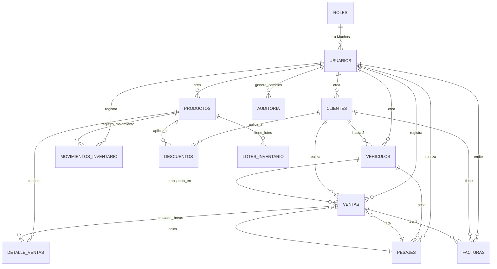

# 📊 Diagrama de Relaciones y Estructura de Base de Datos

## Arquitectura General

```
┌────────────────────────────────────────────────────────────────┐
│              BASE DE DATOS: GestionComercial_BD               │
│         SQL Server Express / SQL Server 2019+                  │
└────────────────────────────────────────────────────────────────┘
```

---

## 🔗 Diagrama Entidad-Relación (ER)



---

## 📋 Tablas Creadas y Descripción

### 1. **ROLES** (Diccionario de Roles)
```
ID_Rol (PK)
├─ Nombre (UNIQUE)
├─ Descripcion
├─ FechaCreacion
└─ FechaModificacion

REGISTROS INICIALES:
- Administrador
- Operador
- Supervisor
```

### 2. **USUARIOS** (Autenticación y Control)
```
ID_Usuario (PK)
├─ NombreUsuario (UNIQUE)
├─ NombreCompleto
├─ Contrasena (Hasheada)
├─ Email
├─ Telefono
├─ ID_Rol (FK → Roles)
├─ Estado (ACTIVO/INACTIVO)
├─ UltimoLogin
├─ FechaCreacion
└─ FechaModificacion

ÍNDICES:
- PK: ID_Usuario
```

### 3. **CLIENTES** (Catálogo de Clientes)
```
ID_Cliente (PK)
├─ CodigoCliente (UNIQUE) - Auto-generado
├─ Nombre
├─ TipoIdentificacion (RUC/Cédula/Pasaporte)
├─ NumeroIdentificacion (UNIQUE) ⚠️ CRÍTICO
├─ Categoria (Transportista/Mayorista/Minorista)
├─ Contacto
├─ Email
├─ Direccion
├─ DescuentoPorDefecto (%)
├─ PlazoCredito (días)
├─ LimiteCredito
├─ SaldoCredito (Saldo actual)
├─ Estado (ACTIVO/INACTIVO/BLOQUEADO)
├─ Observaciones
├─ FechaRegistro
├─ FechaModificacion
└─ UsuarioCreacion (FK → Usuarios)

ÍNDICES:
- PK: ID_Cliente
- IX: NumeroIdentificacion (UNIQUE)

VALIDACIONES:
- No se puede vender a cliente BLOQUEADO
```

### 4. **VEHICULOS** (Vehículos de Clientes)
```
ID_Vehiculo (PK)
├─ ID_Cliente (FK → Clientes) ⚠️ CRÍTICO
├─ Placa (UNIQUE) ⚠️ CRÍTICO
├─ Tipo (Volqueta/Gandola/Furgón)
├─ Marca
├─ Modelo
├─ Color
├─ Capacidad (toneladas)
├─ AnoFabricacion
├─ PesoTara (kg) ⚠️ CRÍTICO para pesaje
├─ VIN
├─ PlacaINEN
├─ Estado (ACTIVO/INACTIVO/MANTENIMIENTO)
├─ UltimaPesada
├─ Observaciones
├─ FechaRegistro
├─ FechaModificacion
└─ UsuarioCreacion (FK → Usuarios)

ÍNDICES:
- PK: ID_Vehiculo
- IX: Placa (UNIQUE)
- IX: ID_Cliente

RESTRICCIONES:
✓ Máximo 2 vehículos ACTIVOS por cliente (Trigger)
✓ Placa única en todo el sistema

RELACIÓN CON CLIENTES:
- 1 Cliente → Hasta 2 Vehículos
```

### 5. **PRODUCTOS** (Catálogo de Materiales)
```
ID_Producto (PK)
├─ Codigo (UNIQUE)
├─ Nombre
├─ TipoMaterial (Arena/Piedra/Cemento/Ladrillo/etc)
├─ Unidad (Kg/Tonelada/Unidad/Metro/Metro2/Metro3)
├─ PrecioBase (por unidad)
├─ Stock (cantidad actual)
├─ StockMinimo (genera alerta)
├─ StockMaximo (límite)
├─ Descripcion
├─ Estado (ACTIVO/INACTIVO)
├─ FechaRegistro
├─ FechaModificacion
└─ UsuarioCreacion (FK → Usuarios)

ÍNDICES:
- PK: ID_Producto
- IX: Codigo

VISTA RESULTANTE:
vw_ProductosStockBajo (alertas automáticas)
```

### 6. **MOVIMIENTOS_INVENTARIO** (Auditoría de Stock)
```
ID_Movimiento (PK)
├─ ID_Producto (FK → Productos)
├─ TipoMovimiento (ENTRADA/SALIDA/AJUSTE)
├─ Cantidad
├─ StockAnterior (snapshot)
├─ StockPosterior (snapshot)
├─ Referencia (número de venta, compra, etc.)
├─ Observaciones
├─ FechaMovimiento
├─ UsuarioMovimiento (FK → Usuarios)

ÍNDICES:
- IX: ID_Producto
- IX: FechaMovimiento
```

### 7. **PESAJES** (Lectura de Báscula - RS232)
```
ID_Pesaje (PK)
├─ ID_Vehiculo (FK → Vehiculos) ⚠️ CRÍTICO
├─ TipoPesaje (TARA/BRUTO)
├─ PesoKg ⚠️ CRÍTICO
├─ Temperatura (opcional, si la báscula lo registra)
├─ Humedad (opcional)
├─ EstadoBascula (Normal/Error/etc)
├─ NumeroSerie (identificador de báscula)
├─ FechaPesaje (registra cuando se pesó)
├─ UsuarioPesaje (FK → Usuarios)
└─ Observaciones

ÍNDICES:
- IX: ID_Vehiculo
- IX: FechaPesaje

FLUJO DE PESAJE:
1. Vehículo llega vacío → Registrar TARA (ID_Pesaje = X)
2. Carga del material (tiempo variable)
3. Vehículo pesa con carga → Registrar BRUTO (ID_Pesaje = Y)
4. NETO = BRUTO - TARA (en tabla VENTAS)
```

### 8. **VENTAS** (Transacciones de Venta)
```
ID_Venta (PK)
├─ NumeroVenta (UNIQUE) - Auto-generado
├─ ID_Cliente (FK → Clientes)
├─ ID_Vehiculo (FK → Vehiculos) (nullable)
├─ ID_PesajeTara (FK → Pesajes) ⚠️ CRÍTICO
├─ ID_PesajeBruto (FK → Pesajes) ⚠️ CRÍTICO
├─ PesoTaraKg (snapshot)
├─ PesoBrutoKg (snapshot)
├─ PesoNetoKg (calculado = Bruto - Tara)
├─ Subtotal
├─ DescuentosAplicados
├─ IVA
├─ TotalVenta
├─ TipoDocumento (TICKET/FACTURA)
├─ EstadoVenta (BORRADOR/COMPLETADA/ANULADA)
├─ UsuarioVenta (FK → Usuarios)
├─ FechaVenta
└─ FechaModificacion

ÍNDICES:
- PK: ID_Venta
- IX: NumeroVenta (UNIQUE)
- IX: ID_Cliente
- IX: FechaVenta

CÁLCULOS AUTOMÁTICOS:
- PesoNetoKg = PesoBrutoKg - PesoTaraKg
- Subtotal = Suma de líneas sin descuentos
- TotalVenta = Subtotal - Descuentos + IVA

VISTA RESULTANTE:
vw_VentasDelDia (para dashboard)
```

### 9. **DETALLE_VENTAS** (Líneas de Venta)
```
ID_DetalleVenta (PK)
├─ ID_Venta (FK → Ventas) - ON DELETE CASCADE
├─ ID_Producto (FK → Productos)
├─ Cantidad
├─ PrecioUnitario
├─ DescuentoLinea (%)
├─ ValorDescuento (calculado)
└─ SubtotalLinea (calculado)

ÍNDICES:
- IX: ID_Venta

RELACIÓN CON VENTAS:
- 1 Venta → Muchas Líneas
- 1 Línea → 1 Producto

EJEMPLO DE USO:
Una venta puede tener:
- 15 toneladas de Arena (PROD001)
- 3 toneladas de Piedra (PROD002)
- 200 ladrillos (PROD004)
```

### 10. **DESCUENTOS** (Configuración de Descuentos)
```
ID_Descuento (PK)
├─ ID_Cliente (FK → Clientes) (nullable)
├─ ID_Producto (FK → Productos) (nullable)
├─ TipoDescuento (CLIENTE/VOLUMEN/TEMPORAL)
├─ PorcentajeDescuento
├─ VolumenMinimo (para descuentos por volumen)
├─ FechaInicio
├─ FechaFin
├─ Observaciones
├─ Estado (ACTIVO/INACTIVO)
└─ FechaCreacion

EJEMPLOS:
1. Descuento por Cliente:
   - Cliente: García & Cía. → 5% en todas las compras

2. Descuento por Volumen:
   - Producto: Arena → Si compra >5 toneladas → 10%

3. Descuento Temporal:
   - Promoción de Abril → 3% hasta fin de mes
```

### 11. **FACTURAS** (Comprobantes Formales)
```
ID_Factura (PK)
├─ NumeroFactura (UNIQUE) - Secuencial
├─ ID_Venta (FK → Ventas) - 1 a 1
├─ ID_Cliente (FK → Clientes)
├─ FechaEmision
├─ FechaVencimiento
├─ SubtotalFactura
├─ IVAFactura
├─ TotalFactura
├─ EstadoFactura (EMITIDA/PAGADA/ANULADA/CRÉDITO)
├─ ObservacionesFactura
├─ UsuarioEmision (FK → Usuarios)

ÍNDICES:
- IX: NumeroFactura (UNIQUE)
- IX: ID_Cliente

DIFERENCIA TICKET vs FACTURA:
- TICKET: Comprobante simple (rápido)
- FACTURA: Comprobante formal (tributario)

RELACIÓN 1:1 CON VENTAS:
- 1 Venta → 1 Factura (puede estar sin factura inicialmente)
```

### 12. **AUDITORIA** (Trazabilidad Total)
```
ID_Auditoria (PK)
├─ ID_Usuario (FK → Usuarios)
├─ Tabla (nombre tabla modificada)
├─ TipoOperacion (INSERT/UPDATE/DELETE)
├─ RegistroID (ID del registro modificado)
├─ DatosAnteriores (JSON del estado anterior)
├─ DatosNuevos (JSON del estado nuevo)
├─ FechaOperacion
├─ DireccionIP (dirección del equipo)
├─ Razon (por qué se hizo el cambio)

ÍNDICES:
- IX: ID_Usuario
- IX: FechaOperacion
- IX: Tabla

PROPÓSITO:
✓ Auditoría completa del sistema
✓ Rastrear quién cambió qué y cuándo
✓ Capacidad de revertir cambios
✓ Cumplimiento normativo
```

### 13. **LOTES_INVENTARIO** (Control Avanzado)
```
ID_Lote (PK)
├─ ID_Producto (FK → Productos)
├─ NumeroLote (identificador del lote)
├─ FechaFabricacion
├─ FechaVencimiento
├─ QuantidadRecibida
├─ QuantidadDisponible
├─ Estado (DISPONIBLE/AGOTADO/EXPIRADO)
├─ Proveedor
└─ FechaIngreso

ÍNDICES:
- IX: ID_Producto
- IX: NumeroLote (UNIQUE)

PROPÓSITO:
✓ FIFO (First In, First Out)
✓ Rastrabilidad de lotes
✓ Control de vencimiento
✓ Auditoría por lote
```

---

## 🔀 Relaciones Principales

### Relación: CLIENTE ↔ VEHICULO
```
RESTRICCIÓN: Máximo 2 vehículos ACTIVOS por cliente

Ejemplo válido:
- Cliente: García & Cía.
  ├─ Vehículo 1: EBC-123 (ACTIVO)
  └─ Vehículo 2: EBC-124 (ACTIVO)
  └─ Vehículo 3: EBC-125 (INACTIVO) ← No cuenta en límite

Intento inválido:
- Insertar 3er vehículo activo → TRIGGER RECHAZA
```

### Relación: VENTA → PESAJE (Tara + Bruto)
```
Flujo de Pesaje:
┌─────────────────────┐
│ 1. Pesaje TARA      │ ← Graba en tabla PESAJES con ID=1
│    (Vehículo vacío) │
└─────────────────────┘
          ↓
┌─────────────────────┐
│ 2. Carga Materal    │
└─────────────────────┘
          ↓
┌─────────────────────┐
│ 3. Pesaje BRUTO     │ ← Graba en tabla PESAJES con ID=2
│    (Vehículo lleno) │
└─────────────────────┘
          ↓
┌─────────────────────┐
│ 4. Crear VENTA      │ ← Vincula ambos pesajes
│    ID_PesajeTara=1  │
│    ID_PesajeBruto=2 │
│    PesoNeto=Calc    │
└─────────────────────┘
```

### Relación: VENTA → DETALLE_VENTAS → PRODUCTO
```
1 Venta puede contener múltiples productos:

VENTA: V001 (Total: $250)
├─ DETALLE_VENTA 1:
│  ├─ Producto: Arena (PROD001)
│  ├─ Cantidad: 15 toneladas
│  ├─ PrecioUnitario: $0.02/kg
│  ├─ DescuentoLinea: 5%
│  └─ SubtotalLinea: $150
│
├─ DETALLE_VENTA 2:
│  ├─ Producto: Piedra (PROD002)
│  ├─ Cantidad: 5 toneladas
│  ├─ PrecioUnitario: $0.035/kg
│  ├─ DescuentoLinea: 0%
│  └─ SubtotalLinea: $175
│
└─ DETALLE_VENTA 3:
   ├─ Producto: Ladrillo (PROD004)
   ├─ Cantidad: 100 unidades
   ├─ PrecioUnitario: $0.45
   ├─ DescuentoLinea: 2%
   └─ SubtotalLinea: $44.10
```

---

## 📊 Vistas Creadas

### 1. `vw_UltimoPesajeVehiculo`
Muestra el último pesaje de cada vehículo
```
Placa | ClienteNombre | PesoKg | TipoPesaje | FechaPesaje
```

### 2. `vw_ProductosStockBajo`
Alertas de productos bajo mínimo
```
Codigo | Nombre | Stock | StockMinimo | Deficit
```

### 3. `vw_VentasDelDia`
Dashboard con ventas del día actual
```
NumeroVenta | ClienteNombre | PesoNetoKg | TotalVenta | OperadorVenta | FechaVenta
```

### 4. `vw_ResumenCliente`
Historial de cliente con saldo de crédito
```
Nombre | TotalTransacciones | MontoTotalComprado | SaldoCredito | DisponibleCredito
```

---

## ⚠️ Constraints y Validaciones

| Campo | Tipo | Acción |
|-------|------|--------|
| Cliente.NumeroIdentificacion | UNIQUE | Previene duplicados |
| Vehiculo.Placa | UNIQUE | Previene duplicados |
| Vehículos por Cliente | TRIGGER | Máximo 2 activos |
| Cliente.Estado | CHECK | ACTIVO/INACTIVO/BLOQUEADO |
| Vehiculo.Estado | CHECK | ACTIVO/INACTIVO/MANTENIMIENTO |
| Pesaje.TipoPesaje | CHECK | TARA/BRUTO |
| Venta.EstadoVenta | CHECK | BORRADOR/COMPLETADA/ANULADA |
| Factura.EstadoFactura | CHECK | EMITIDA/PAGADA/ANULADA/CRÉDITO |

---

## 🎯 Consideraciones de Implementación

### Seguridad
✓ Todas las contraseñas deben estar HASHEADAS (bcrypt)
✓ Registro de auditoría en cada operación
✓ Validaciones en BD y en aplicación

### Rendimiento
✓ Índices en todas las claves foráneas
✓ Índices en campos de búsqueda frecuente
✓ Vistas para consultas complejas

### Integridad
✓ Relaciones con Foreign Keys
✓ Cascadas de eliminación donde corresponda
✓ Triggers para reglas de negocio complejas

### Offline-First
✓ Base de datos local en el cliente
✓ Sincronización futura con servidor
✓ Capacidad de trabajar sin conectividad
